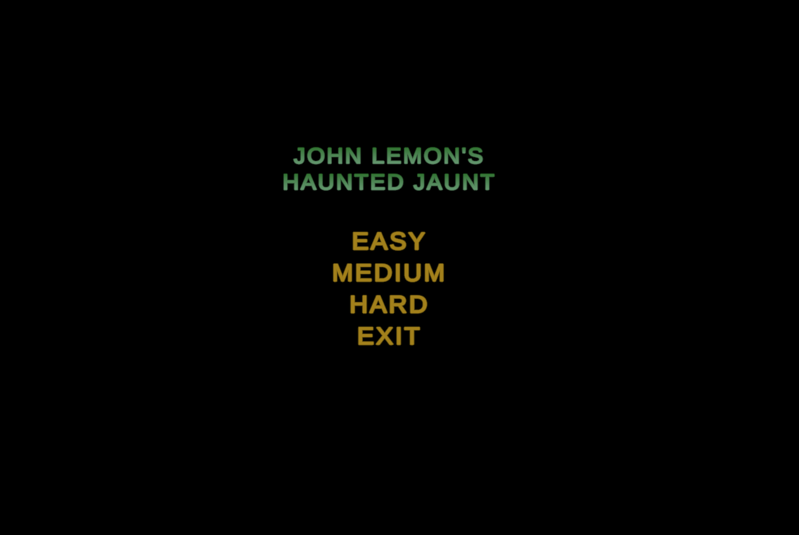

# John Lemon's Haunted Jaunt - but modified

I followed this Unity tutorial (https://learn.unity.com/project/john-lemon-s-haunted-jaunt-3d-beginner) and modified it to make it more exciting. 
Keep reading to see my modifications!

## Main Menu and Difficulty Settings

A main menu was added with three difficulty options in order to add more of a challenge for the player.

## Invincibility

Invincibility spheres add more fun and ease to the game by allowing the player to get by monsters without being seen. 
A blinking effect was added to John Lemon during his invincibility period in order to provide the player feedback for the length of his invincibility. 

## Timer

A timer makes the game more difficult, as the payer needs to get out of the haunted house as fast as they can. 

